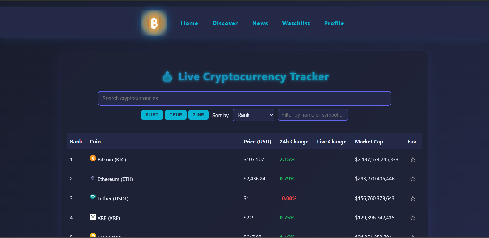

# 💰 Crypto Currency Tracker

A sleek, real-time cryptocurrency tracker web app that fetches live data and trends of major digital currencies — built with love and precision.

🌐 **Live Demo**: [crypto-currency-tracker-five.vercel.app](https://crypto-currency-tracker-five.vercel.app)



---

## 🚀 Features

- 📈 **Live Market Prices** – Tracks live cryptocurrency values and percentage changes
- 🔍 **Search Functionality** – Instantly search coins by name or symbol
- 📊 **Dynamic UI** – Fully responsive and modern interface
- 🌙 **Dark Mode** – Eye-friendly design for all-day use
- 🛡️ **Firebase Authentication** – Secure signup and login
- ⭐ **Watchlist** – Save your favorite coins for quick access
- 📰 **News Feed** – Displays crypto-related news in real time

---

## 🛠️ Tech Stack

| Frontend | Styling | Backend/Auth | APIs | Hosting |
|----------|---------|--------------|------|---------|
| `HTML5`, `JavaScript` | `CSS3`, `Flexbox`, `Responsive Design` | `Firebase` | `CoinGecko`, `NewsAPI` | [Vercel]([https://vercel.com/](https://crypto-currency-tracker-five.vercel.app)) |

---

## 📁 Folder Structure

```
├── .git/
├── assets/
├── firebase-config.js       # Firebase setup for authentication
├── logo3d.js                # 3D logo animation
├── script.js                # Main JS logic
├── style.css                # Global styles
├── index.html               # Home page
├── discover.html            # Discover coins page
├── login.html               # Login interface
├── signup.html              # Signup form
├── profile.html             # User profile page
├── watchlist.html           # User watchlist
├── news.html                # Crypto news page
```

---

## 📸 Screenshots

| Desktop View | Mobile View |
|--------------|-------------|
|  |  |

---

## 🧠 Learning Outcomes

> Through this project, I honed my skills in authentication, real-time API handling, and modern frontend design patterns using modular files and JavaScript.

---

## 🔧 Setup & Run Locally

```bash
git clone https://github.com/HarshKhetan20/crypto-currency-tracker.git
cd crypto-currency-tracker
# Open index.html in browser or use Live Server
```

---

## 🔒 Firebase Auth Details

- Includes user login, signup, logout
- Stores session info securely in Firebase
- Extendable to include user preferences (e.g., currency units)

---

## 📞 Contact Me  

💡 Have questions or want to collaborate? Feel free to reach out!  

🔗 **Portfolio:** https://harsh-khetan-portfolio.vercel.app/

📧 **Email:** harshkhetan20@gmail.com 

🌐 **GitHub:** HarshKhetan20 (https://github.com/HarshKhetan20)

💼 **LinkedIn:** HarshKhetan20 (https://www.linkedin.com/in/harshkhetan20/)  

---

---

## 📄 License

Licensed under the **MIT License**.  
Free to use, improve, and share — just give credit.

---

🔥 **If you like this project, don't forget to ⭐ the repository!** 🚀

💡 **Track smart. Trade smarter.** – Built by Harsh Khetan
